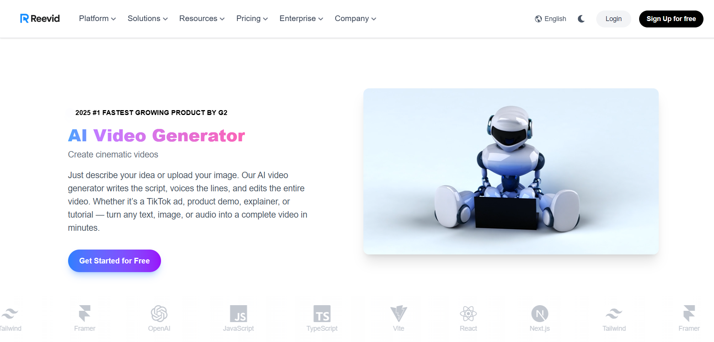
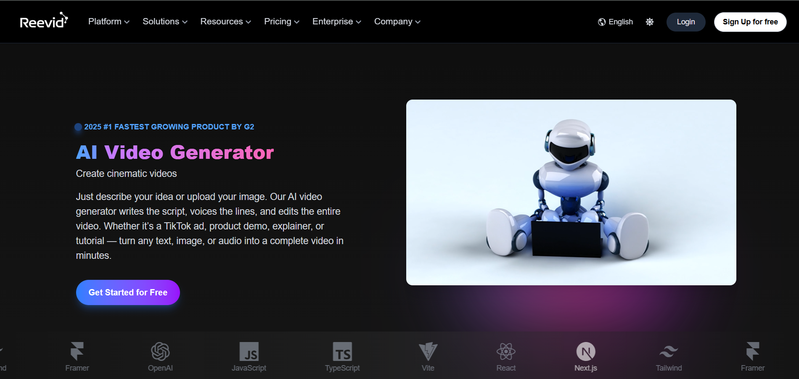

# 🚀 Reevid – Modern AI Video Generator Landing Page



Reevid is a visually stunning, high-performance AI video generator landing page built with modern technologies like **React**, **Framer Motion**, and **Tailwind CSS**. Designed for modern SaaS platforms, Reevid highlights product potential through sleek UI, smooth animations, and a responsive design — all while supporting **light and dark modes** for the ultimate user experience.

---

## 🎯 Features

- ⚡ **Framer Motion animations** – buttery-smooth transitions for all UI elements  
- 🌓 **Light/Dark Mode Toggle** – with smooth theme transitions  
- 🧠 **AI Video Showcase** – dynamic video section with interactive hover effects  
- 🎥 **Use Cases & Features Sections** – beautifully arranged and animated  
- 🌐 **Responsive Design** – works flawlessly across all screen sizes  
- 💡 **Futuristic UI Aesthetic** – powered by Tailwind CSS v4 with custom design tokens  
- 🎨 **Custom Fonts, Gradients, and Shadows** – to make it look bold and modern  
- 🌈 **Neural Playground & Pricing Sections** – highlight product interactivity and pricing plans  

---

## 🖼️ Screenshots

### 💻 Light Mode


### 🌙 Dark Mode


---

## 🛠️ Built With

- [React](https://reactjs.org/)
- [Tailwind CSS v4](https://tailwindcss.com/)
- [Framer Motion](https://www.framer.com/motion/)
- [SplitType.js (for text animation)](https://github.com/lukePeavey/SplitType)
- [React Icons](https://react-icons.github.io/react-icons/)

---

## 🚀 Getting Started

### 📦 Installation

```bash
git clone https://github.com/your-username/reevid.git
cd reevid
npm install


▶️ Run the Development Server
npm run dev
🛠 Build for Production
npm run build

🧪 Folder Structure
reevid/
├── public/
│   └── screenshot.png
├── src/
│   ├── components/
│   ├── sections/
│   ├── styles/
│   └── App.jsx
├── tailwind.config.js
└── index.html

👤 Author
Krishna Sahu
📧 krishna.sahu.work@gmail.com

📄 License
This project is licensed under the MIT License – see the LICENSE file for details.

📢 Feedback
If you have any feedback, ideas, or suggestions, feel free to open an issue or contact me directly.


